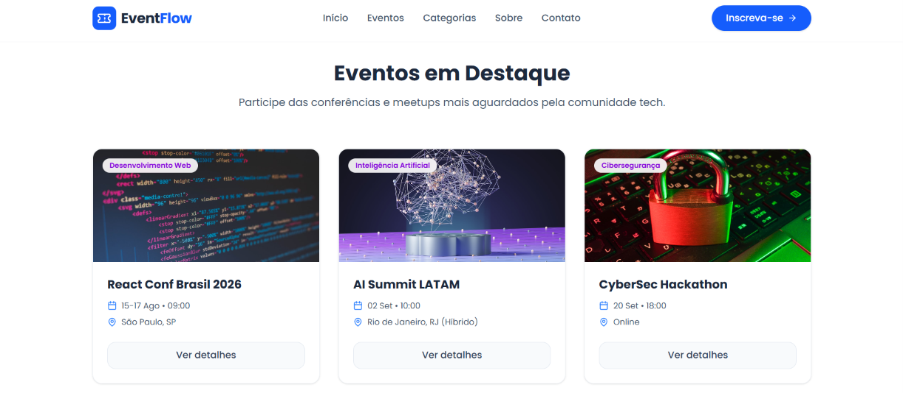
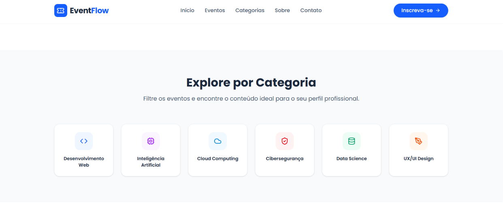
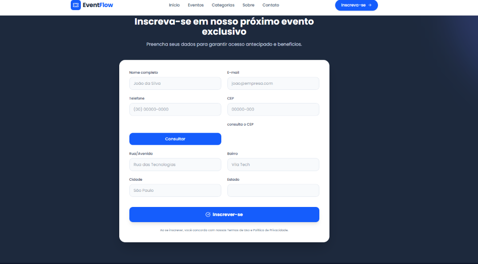

# EventFlow | Plataforma de Eventos Tech

O EventFlow é uma Landing Page moderna e responsiva desenvolvida para conectar pessoas, conhecimento e oportunidades através de eventos tecnológicos. A plataforma permite visualizar eventos em destaque, explorar categorias da área de tecnologia e realizar inscrições de forma simples e intuitiva.

Além disso, o projeto conta com integração com a API ViaCEP para preenchimento automático do endereço durante a inscrição, proporcionando uma melhor experiência para o usuário.

> Desenvolvido como projeto acadêmico utilizando boas práticas de desenvolvimento Front-End.

---

## Demonstração

- Deploy: https://event-flow-fawn-six.vercel.app/
- Repositório: https://github.com/mamadudev/EventFlow

---

## Funcionalidades

- Landing Page moderna e responsiva;
- Navegação intuitiva entre as seções do projeto;
- Exibição de eventos tecnológicos em destaque;
- Exploração de categorias da área Tech;
- Formulário completo de inscrição;
- Consulta automática de CEP utilizando a API ViaCEP;
- Preenchimento automático dos campos de endereço;
- Tratamento de CEP inválido e erros na requisição;
- Design adaptável para dispositivos móveis;
- Deploy em ambiente de produção utilizando Vercel.

---

## Tecnologias Utilizadas

| Tecnologia | Finalidade |
|------------|------------|
| React | Construção da interface |
| TypeScript | Segurança e tipagem do projeto |
| Vite | Ambiente de desenvolvimento e build |
| Tailwind CSS | Estilização da aplicação |
| ViaCEP API | Consulta automática de CEP |
| Git | Controle de versão |
| GitHub | Hospedagem do código-fonte |
| Vercel | Deploy da aplicação |

---

## Ferramentas Utilizadas

- Visual Studio Code
- Git Bash
- GitHub
- Vercel
- Lovable (utilizado como ponto de partida do layout, posteriormente customizado e expandido manualmente)

---

## Telas do Projeto






### Página Inicial

- Apresentação da plataforma;
- Destaque dos principais eventos;
- Sessão explicando como funciona a inscrição.

### Categorias

- Desenvolvimento Web;
- Inteligência Artificial;
- Cloud Computing;
- Cibersegurança;
- Data Science;
- UX/UI Design.

### Formulário de Inscrição

O formulário foi desenvolvido para proporcionar uma experiência simples e rápida ao usuário contendo:

- Nome completo;
- E-mail;
- Telefone;
- CEP;
- Rua/Avenida;
- Bairro;
- Cidade;
- Estado.

Ao informar um CEP válido, os dados do endereço são preenchidos automaticamente através da integração com a API ViaCEP.

---

## Integração com API

O projeto realiza requisições assíncronas utilizando a Fetch API para consumir a API pública ViaCEP.

### Exemplo

```javascript
https://viacep.com.br/ws/01001000/json/
```

### Dados retornados

```json
{
    "logradouro":"Praça da Sé",
    "bairro":"Sé",
    "localidade":"São Paulo",
    "uf":"SP"
}
```

---

## Estrutura do Projeto

```bash
EventFlow
│
├── src
│   ├── app
│   │    ├── components
│   │    └── App.tsx
│   │
│   └── styles
│
├── index.html
├── package.json
├── vite.config.ts
└── README.md
```

---

## Executando o Projeto

### Clone o repositório

```bash
git clone https://github.com/mamadudev/EventFlow.git
```

### Entre na pasta do projeto

```bash
cd EventFlow
```

### Instale as dependências

```bash
npm install
```

### Execute o projeto

```bash
npm run dev
```

A aplicação estará disponível em:

```bash
http://localhost:5173
```

### Gerar a Build de Produção

```bash
npm run build
```

### Visualizar a Build Localmente

```bash
npm run preview
```

---

## Conceitos Aplicados

Durante o desenvolvimento foram utilizados conceitos importantes do ecossistema Front-End, tais como:

- Componentização com React;
- React Hooks (useState);
- Consumo de APIs REST;
- Programação assíncrona com Fetch API;
- Tratamento de erros;
- Responsividade utilizando Tailwind CSS;
- Versionamento utilizando Git e GitHub;
- Boas práticas de organização de componentes;
- Deploy em ambiente de produção.

---

## Fluxo de Desenvolvimento

O projeto foi desenvolvido utilizando o Git Flow simplificado com duas branches principais:

```bash
main
│
└── develop
```

- `develop` utilizada durante o desenvolvimento das funcionalidades;
- `main` utilizada para publicação da versão final do projeto.

---

## Autor

### Mamadou Diagne

- GitHub: https://github.com/mamadudev
- LinkedIn: https://www.linkedin.com/in/mamadudev/

---

## Licença

Este projeto foi desenvolvido para fins acadêmicos e educacionais.